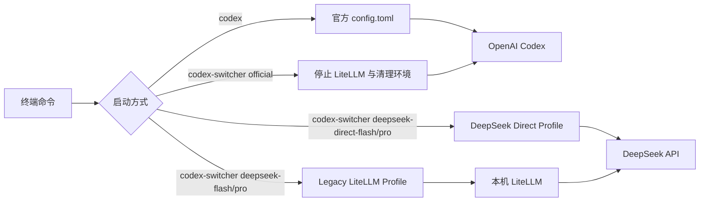

# codex-switcher

在官方 OpenAI Codex、DeepSeek V4 Pro、DeepSeek V4 Flash 和其他自定义 Provider 之间安全切换。

| 项目 | 当前配置 |
|---|---|
| 切换器 | `codex-switcher 2.1.0` |
| Codex 主目录 | `/home/luoxihao/.codex` |
| DeepSeek 推荐路径 | 官方直连，`https://api.deepseek.com/` |
| DeepSeek 备用路径 | LiteLLM，监听 `127.0.0.1:4000` |
| 官方恢复模型 | `gpt-5.4` |
| 配置更新时间 | 2026-08-06 |

> [!IMPORTANT]
> 遇到第三方 Provider、Key、代理或环境变量问题时，执行 `codex-switcher official`。这是本机强制返回官方 Codex 的安全入口。

## 目录

- [快速开始](#快速开始)
- [安装或更新](#安装或更新)
- [工作原理](#工作原理)
- [配置 DeepSeek Key](#配置-deepseek-key)
- [启动与恢复会话](#启动与恢复会话)
- [Codex 命令兼容性](#codex-命令兼容性)
- [DeepSeek 功能支持](#deepseek-功能支持)
- [Profile 管理](#profile-管理)
- [VS Code](#vs-code)
- [强制返回官方](#强制返回官方)
- [故障排查](#故障排查)
- [文件结构](#文件结构)
- [安全说明](#安全说明)
- [参考资料](#参考资料)

## 快速开始

### 常用命令

```bash
# 普通启动官方 Codex
codex

# 启动 DeepSeek 官方直连（推荐）
codex-switcher deepseek-direct-flash
codex-switcher deepseek-direct-pro

# 启动旧 LiteLLM 桥接（备用）
codex-switcher deepseek-pro
codex-switcher deepseek-flash

# 恢复最近的 DeepSeek 直连会话
codex-switcher deepseek-direct-flash resume --last

# 强制停止代理并返回官方 Codex
codex-switcher official
```

### 命令速查

| 目的 | 命令 |
|---|---|
| 官方 Codex | `codex` |
| DeepSeek Flash 直连 | `codex-switcher deepseek-direct-flash` |
| DeepSeek Pro 直连 | `codex-switcher deepseek-direct-pro` |
| DeepSeek Flash 旧桥接 | `codex-switcher deepseek-flash` |
| DeepSeek Pro 旧桥接 | `codex-switcher deepseek-pro` |
| 强制返回官方 | `codex-switcher official` |
| 查看 Profile | `codex-switcher list` |
| 查看帮助 | `codex-switcher --help` |
| 查看版本 | `codex-switcher --version` |

## 安装或更新

本机工具源码位于 `/home/luoxihao/codex-switcher`。安装或覆盖更新：

```bash
sh ~/codex-switcher/install.sh
```

安装器只写入 `~/.local/bin/codex-switcher`。如果不希望它修改 Shell 的 PATH 配置：

```bash
CODEX_SWITCHER_NO_PATH=1 sh ~/codex-switcher/install.sh
```

自定义安装目录时使用 `CODEX_SWITCHER_BIN_DIR`。

## 工作原理



### 作用范围

切换只影响新启动的进程：

- `codex-switcher deepseek-direct-flash` 只影响它启动的 Codex。
- `codex-switcher deepseek-flash` 是旧 LiteLLM 桥接路径，作为备用保留。
- 已经打开的其他 Codex 或 VS Code 会话不会自动切换。
- 关闭 DeepSeek Codex 后，直接运行 `codex` 会使用官方默认配置。
- 后台 LiteLLM 即使仍在运行，普通 `codex` 也不会调用它。
- `codex-switcher official` 和 DeepSeek 直连都会停止旧 LiteLLM 并完成环境清理。

## 配置 DeepSeek Key

> [!IMPORTANT]
> 本机 DeepSeek Key 是持久写入 TOML，不是临时环境变量。保存后关闭终端或重启电脑仍然有效。

### 配置文件

```text
/home/luoxihao/.codex/deepseek-pro.config.toml
/home/luoxihao/.codex/deepseek-flash.config.toml
/home/luoxihao/.codex/deepseek-direct-pro.config.toml
/home/luoxihao/.codex/deepseek-direct-flash.config.toml
```

### 编辑 Key

```bash
codex-switcher edit deepseek-direct-flash
codex-switcher edit deepseek-direct-pro
codex-switcher edit deepseek-pro
codex-switcher edit deepseek-flash
```

直连 Profile 使用：

```toml
[model_providers.deepseek-direct]
name = "DeepSeek Direct"
base_url = "https://api.deepseek.com/"
wire_api = "responses"
requires_openai_auth = false
supports_websockets = false
experimental_bearer_token = "在这里填写真实 DeepSeek API Key"
```

旧 LiteLLM 桥接 Profile 使用：

```toml
[model_providers.litellm-deepseek]
name = "DeepSeek V4 via local LiteLLM"
base_url = "http://127.0.0.1:4000/v1"
wire_api = "responses"
requires_openai_auth = false
supports_websockets = false
experimental_bearer_token = "在这里填写真实 DeepSeek API Key"
```

如果使用 Vim：

1. 按 `i` 进入编辑模式。
2. 替换 `experimental_bearer_token` 引号内的内容。
3. 按 `Esc`。
4. 输入 `:wq` 并回车。

> [!NOTE]
> Direct 与旧桥接 Profile 都把 Key 持久写入 TOML。可以填写同一个 DeepSeek Key，也可以填写不同 Key。

> [!WARNING]
> 不要把真实 Key 写进本文档、复制到公共目录或提交到 Git。

### 不需要环境变量

本机 DeepSeek 不需要下面这种临时写法：

```bash
# 不需要这样启动本机 DeepSeek
DEEPSEEK_API_KEY='你的密钥' codex-switcher deepseek-pro
```

启动器会从对应 TOML 的 `experimental_bearer_token` 读取 Key，并且不会在终端中打印它。

## 启动与恢复会话

### 启动

```bash
codex-switcher deepseek-direct-flash
codex-switcher deepseek-direct-pro

# 旧 LiteLLM 桥接备用
codex-switcher deepseek-flash
codex-switcher deepseek-pro
```

启动器会自动：

1. 检查对应 Profile 和 Key。
2. 对直连 Profile 安装官方 DeepSeek 模型目录。
3. 对旧桥接 Profile 启动或复用本机 LiteLLM。
4. 使用对应 Profile 启动 Codex。

### 恢复会话

```bash
# 打开会话选择器
codex-switcher deepseek-direct-flash resume
codex-switcher deepseek-direct-pro resume

# 恢复最近一次会话
codex-switcher deepseek-direct-flash resume --last
codex-switcher deepseek-direct-pro resume --last

# 按会话 ID 恢复
codex-switcher deepseek-direct-flash resume <SESSION_ID>
codex-switcher deepseek-direct-pro resume <SESSION_ID>
```

> [!CAUTION]
> 不要用普通 `codex resume` 恢复 DeepSeek 会话。恢复时继续使用创建该会话的原 Profile。

即使中间执行过 `codex-switcher official`，DeepSeek 恢复命令也会重新准备对应直连目录或旧 LiteLLM。

## Codex 命令兼容性

`codex-switcher <profile> ...` 实际会调用：

```text
codex --profile <profile> ...
```

因此参数会透传给 Codex，但只有 Codex 原生允许搭配 `--profile` 的命令才能使用。

### 支持通过 codex-switcher 运行

| 功能 | 示例 |
|---|---|
| 交互式 Codex | `codex-switcher deepseek-direct-flash` |
| 非交互任务 | `codex-switcher deepseek-direct-flash exec "检查项目"` |
| 非交互任务别名 | `codex-switcher deepseek-direct-flash e "运行测试"` |
| 代码审查 | `codex-switcher deepseek-direct-flash review` |
| 恢复会话 | `codex-switcher deepseek-direct-flash resume --last` |
| 分叉会话 | `codex-switcher deepseek-direct-flash fork --last` |
| 归档会话 | `codex-switcher deepseek-direct-flash archive <SESSION_ID>` |
| 删除会话 | `codex-switcher deepseek-direct-flash delete <SESSION_ID>` |
| 取消归档 | `codex-switcher deepseek-direct-flash unarchive <SESSION_ID>` |
| Codex 沙箱 | `codex-switcher deepseek-direct-flash sandbox --help` |
| MCP 管理 | `codex-switcher deepseek-direct-flash mcp --help` |
| 指定目录 | `codex-switcher deepseek-direct-flash -C /path/to/project` |
| 指定沙箱 | `codex-switcher deepseek-direct-flash --sandbox read-only` |
| Debug prompt-input | `codex-switcher deepseek-direct-flash debug prompt-input --help` |

> [!WARNING]
> `delete` 会永久删除指定会话，使用前确认会话 ID。

### 必须直接使用原生 codex

下面这些属于安装、认证、服务或全局管理，不应通过 DeepSeek Profile 启动：

| 功能 | 正确命令 |
|---|---|
| 登录状态 | `codex login status` |
| 登录/退出 | `codex login` / `codex logout` |
| 安装诊断 | `codex doctor` |
| 更新 Codex | `codex update` |
| 插件管理 | `codex plugin --help` |
| MCP Server | `codex mcp-server` |
| App Server | `codex app-server --help` |
| 远程控制 | `codex remote-control --help` |
| Shell 补全 | `codex completion zsh` |
| 应用最近补丁 | `codex apply` |
| Codex Cloud | `codex cloud --help` |
| 功能开关 | `codex features` |
| Exec Server | `codex exec-server` |
| 其他 Debug | `codex debug --help` |

错误示例：

```bash
codex-switcher deepseek-direct-flash login status
codex-switcher deepseek-direct-flash doctor
codex-switcher deepseek-direct-flash update
```

正确示例：

```bash
codex login status
codex doctor
codex update
```

## DeepSeek 功能支持

`codex-switcher` 能透传 Codex 命令，不代表 DeepSeek 能提供全部 OpenAI 原生模型能力。

| 功能 | 状态 | 说明 |
|---|---|---|
| 交互式编码 | 支持 | 通过 Codex CLI 使用 |
| Shell 命令 | 支持 | 已完成真实工具回合测试 |
| 文件读取与修改 | 支持 | 受 Codex 沙箱和审批策略限制 |
| `exec` | 支持 | 使用对应 DeepSeek Profile |
| `review` | 支持命令 | 最终效果取决于模型能力 |
| 会话恢复与分叉 | 支持 | 必须继续带原 Profile |
| 审批与沙箱 | 支持 | 由 Codex CLI 执行 |
| 普通函数工具 | 直连支持 | 旧桥接由 LiteLLM 转换 |
| 并行工具调用 | 直连开启 | 旧桥接关闭，避免工具历史错误 |
| OpenAI 原生网页搜索 | 直连声明支持 | 实际效果取决于 DeepSeek API |
| 图片输入 | 当前不支持 | 当前只声明文本输入 |
| OpenAI 专属高级工具 | 不保证 | 旧桥接更容易在转换时降级 |
| MCP/插件模型工具 | 视工具而定 | 普通函数调用兼容性更好 |

### 推荐路径

优先使用 `deepseek-direct-flash` / `deepseek-direct-pro`。直连 Profile 使用 DeepSeek 官方 Codex 模型目录和 `https://api.deepseek.com/`，不再经过本机 LiteLLM，因此不会出现 LiteLLM 丢弃 Codex `namespace` 工具的问题。

### LiteLLM 兼容处理

旧 `deepseek-flash` / `deepseek-pro` 桥接层负责：

- Responses API 到 DeepSeek 接口的转换。
- 规范化 Codex 工具调用历史。
- 清除工具调用与结果之间的空 assistant 消息。
- 校验 `tool_call_id` 与工具结果。
- 关闭并行工具调用。
- 返回 Codex 所需的模型目录格式。

## Profile 管理

```bash
# 查看
codex-switcher list

# 创建普通第三方 Profile
codex-switcher create provider-a

# 编辑
codex-switcher edit provider-a
CODEX_SWITCHER_EDITOR=nvim codex-switcher edit provider-a

# 删除（默认要求确认）
codex-switcher delete provider-a

# 跳过确认，谨慎使用
codex-switcher delete provider-a --yes

# 交互选择 Profile
codex-switcher
```

`remove` 和 `rm` 是 `delete` 的别名。删除 Profile 不会删除 `config.toml` 或 `auth.json`。

保留名称：

```text
official default reset restore list create edit delete remove rm help version
```

<details>
<summary><strong>其他普通第三方 Provider 配置</strong></summary>

本节不适用于已经配置好的 DeepSeek direct 或 legacy Profile。

| 类型 | Key 保存方式 |
|---|---|
| DeepSeek Direct/Legacy | 持久写入 TOML 的 `experimental_bearer_token` |
| 其他普通 Provider | 推荐使用 `env_key` 和 Shell 环境变量 |

Responses API Provider 最小示例：

```toml
model = "some-coder-model"
model_provider = "provider_a"

[model_providers.provider_a]
name = "Provider A"
base_url = "https://api.example.com/v1"
env_key = "PROVIDER_A_API_KEY"
wire_api = "responses"
```

运行：

```bash
PROVIDER_A_API_KEY='你的密钥' codex-switcher provider-a
```

只提供 `/v1/chat/completions`、没有 Responses API 的 Provider 不能直接接入 Codex，需要协议转换层。

</details>

## VS Code

完全退出已有 VS Code 后运行：

```bash
codex-switcher vscode deepseek-pro
codex-switcher vscode deepseek-flash
codex-switcher vscode deepseek-direct-pro
codex-switcher vscode deepseek-direct-flash
codex-switcher vscode provider-a
codex-switcher vscode official
```

已有 VS Code 进程可能继续沿用旧环境，因此必须完全退出后重新启动。

独立窗口模式：

```bash
codex-switcher vscode provider-a --isolated
```

独立模式使用单独的 VS Code 用户数据目录，但可能需要重新设置部分 VS Code 偏好。

## 强制返回官方

```bash
codex-switcher official
```

等价别名：

```bash
codex-switcher default
codex-switcher reset
codex-switcher restore
```

官方回退会：

1. 停止 `codex-switcher` 管理的 LiteLLM。
2. 清除 DeepSeek、LiteLLM、OpenAI Base URL 和 API Key 环境覆盖。
3. 忽略继承的 `HOME`、`CODEX_HOME` 和 `CODEX_SWITCHER_HOME`。
4. 固定使用 `/home/luoxihao/.codex`。
5. 移除临时 DeepSeek 模型元数据。
6. 强制 `model_provider="openai"`。
7. 强制官方 `gpt-5.4`。
8. 保留 `~/.codex/auth.json` 和现有 ChatGPT 登录。

> [!NOTE]
> 此回退已经在同时污染 `HOME`、`CODEX_HOME`、`CODEX_SWITCHER_HOME`、`OPENAI_BASE_URL` 和 Provider Key 的情况下验证，最终仍显示 `Logged in using ChatGPT`。

## 故障排查

<details open>
<summary><strong>Key 尚未填写</strong></summary>

```bash
codex-switcher edit deepseek-pro
codex-switcher edit deepseek-flash
codex-switcher edit deepseek-direct-pro
codex-switcher edit deepseek-direct-flash
```

确认 `experimental_bearer_token` 已保存，但不要在终端打印真实 Key。

</details>

<details>
<summary><strong>LiteLLM 启动失败</strong></summary>

```bash
less ~/.codex/litellm/litellm.log
```

常见原因：

- `127.0.0.1:4000` 被占用。
- Key 缺失或无效。
- LiteLLM 虚拟环境被删除。
- LiteLLM 配置被错误修改。

</details>

<details>
<summary><strong>DeepSeek 出错</strong></summary>

先安全回到官方：

```bash
codex-switcher official
```

再检查：

```bash
codex login status
codex-switcher --version
codex --version
```

</details>

## 文件结构

```text
/home/luoxihao/.codex/
├── auth.json                         # 官方 ChatGPT 登录
├── config.toml                       # 官方默认配置
├── deepseek-direct-models.json        # DeepSeek 官方直连模型目录
├── deepseek-direct-pro.config.toml    # Pro 直连 Profile，权限 600
├── deepseek-direct-flash.config.toml  # Flash 直连 Profile，权限 600
├── deepseek-pro.config.toml          # Pro Profile，权限 600
├── deepseek-flash.config.toml        # Flash Profile，权限 600
├── bin/
│   ├── codex-switcher               # 当前包装器源码
│   └── codex-switcher-1.0.0         # 改造前备份
└── litellm/
    ├── config.yaml                   # 模型映射
    ├── manage.py                     # 代理与元数据管理
    ├── bridge_guard.py               # 工具历史兼容保护
    ├── litellm.log                   # 运行日志
    └── venv/                         # 独立 Python 环境

/home/luoxihao/.local/bin/
└── codex-switcher                   # 实际执行命令，版本 2.1.0

/home/luoxihao/codex-switcher/
├── assets/deepseek-direct-models.json # DeepSeek 官方模型目录资产
├── install.sh                       # 安装脚本
├── README.md                        # 项目说明
└── bin/codex-switcher               # 可安装命令源码
```

## 安全说明

> [!WARNING]
> - 不要提交 API Key、DeepSeek Profile 或 `auth.json`。
> - 不要删除或复制 `auth.json` 来切换 Provider。
> - `~/.local/bin/codex-switcher` 是当前唯一受支持的切换命令。
> - 重新安装时只使用 `~/codex-switcher/install.sh`。
> - 删除 Profile 或会话前先确认目标。

Profile 权限：

```text
600 ~/.codex/deepseek-pro.config.toml
600 ~/.codex/deepseek-flash.config.toml
600 ~/.codex/deepseek-direct-pro.config.toml
600 ~/.codex/deepseek-direct-flash.config.toml
600 ~/.codex/deepseek-direct-models.json
```

## 参考资料

- [Codex 配置参考](https://developers.openai.com/codex/config-reference/)
- [Codex CLI 参考](https://developers.openai.com/codex/cli/reference/)
- [DeepSeek Codex Setup](https://cdn.deepseek.com/api-docs/codex-deepseek-setup.sh)
- [LiteLLM Responses API](https://docs.litellm.ai/docs/response_api)
- [LiteLLM DeepSeek Provider](https://docs.litellm.ai/docs/providers/deepseek)

---

如果不确定当前 Provider 状态，执行：

```bash
codex-switcher official
```
