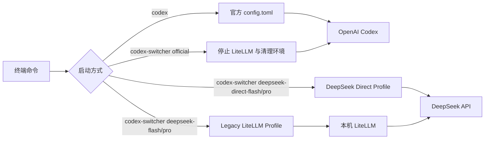

# codex-switcher

在官方 OpenAI Codex 与 DeepSeek 等第三方 Provider 之间安全切换的命令行包装器。

`codex-switcher` 本身是 Codex CLI 的一层薄封装：它按 Profile 准备环境（模型目录、API Key、可选的 LiteLLM 代理），再以 `codex --profile <name>` 启动，避免手工改配置、污染环境变量或在多个 Provider 之间反复切换出错。

> [!TIP]
> 相关项目：[proxy-switcher](../proxy-switcher) 提供 Linux 桌面的统一代理切换，两者可以配合使用。

## 目录

- [特性](#特性)
- [环境要求](#环境要求)
- [快速开始](#快速开始)
- [安装 / 更新 / 卸载](#安装--更新--卸载)
- [工作原理](#工作原理)
- [使用](#使用)
- [配置 DeepSeek Key](#配置-deepseek-key)
- [启动与恢复会话](#启动与恢复会话)
- [Codex 命令兼容性](#codex-命令兼容性)
- [Profile 管理](#profile-管理)
- [VS Code](#vs-code)
- [强制返回官方](#强制返回官方)
- [环境变量参考](#环境变量参考)
- [故障排查](#故障排查)
- [文件结构](#文件结构)
- [迁移到其他机器](#迁移到其他机器)
- [安全说明](#安全说明)
- [参考资料](#参考资料)

## 特性

- 官方 Codex、DeepSeek 官方直连、DeepSeek LiteLLM 桥接三种 Profile 一键切换。
- API Key 持久化写入 Profile TOML（权限 600），不依赖临时环境变量。
- 支持会话恢复（`resume`）、分叉（`fork`）、归档（`archive`）等 Codex 常用命令透传。
- 旧 LiteLLM 桥接路径自动管理代理进程，切换或恢复官方时自动清理。
- 提供 VS Code 集成，让 VS Code 内嵌 Codex 使用指定 Provider。
- 提供 `install.sh` / `uninstall.sh`，安装、更新、卸载一条命令完成。

## 环境要求

| 依赖 | 说明 |
|---|---|
| Codex CLI | `codex` 命令需在 `PATH` 中，或通过 `CODEX_SWITCHER_CODEX_BIN` 指定路径 |
| POSIX Shell | 安装脚本使用 `sh`，包装器为 POSIX shell 脚本 |
| LiteLLM（可选） | 仅旧桥接 Profile（`deepseek-flash` / `deepseek-pro`）需要独立的 LiteLLM 运行环境 |
| 编辑器（可选） | 编辑 Profile 时使用 `$EDITOR`，可通过 `CODEX_SWITCHER_EDITOR` 覆盖 |

## 快速开始

把仓库克隆到任意目录（下文以 `~/codex-switcher` 为例），然后安装：

```bash
git clone <仓库地址> ~/codex-switcher
cd ~/codex-switcher
sh install.sh
```

安装完成后：

```bash
# 查看已有哪些 Profile
codex-switcher list

# 启动 DeepSeek 官方直连（推荐）
codex-switcher deepseek-direct-flash
codex-switcher deepseek-direct-pro

# 启动旧 LiteLLM 桥接（备用）
codex-switcher deepseek-flash
codex-switcher deepseek-pro

# 恢复最近的 DeepSeek 直连会话
codex-switcher deepseek-direct-flash resume --last

# 强制停止代理并返回官方 Codex
codex-switcher official
```

`deepseek-direct-*`、`deepseek-*` 是预置 Profile 名称；它们对应的 TOML 会在首次编辑 Key 时创建（见[配置 DeepSeek Key](#配置-deepseek-key)）。

## 安装 / 更新 / 卸载

### 安装或更新

```bash
sh ~/codex-switcher/install.sh
```

安装器只写入用户目录，不需要 root：

1. 把 `bin/codex-switcher` 安装到 `~/.local/bin/codex-switcher`。
2. 如果 Codex 主目录下存在 `bin/` 或 `codex-switcher-package/bin/`，同步一份命令过去。
3. 安装 DeepSeek 直连模型目录到 Codex 主目录。
4. 如尚未配置，向 shell 启动文件追加 `~/.local/bin` 的 `PATH`。

不希望修改 shell 配置时：

```bash
CODEX_SWITCHER_NO_PATH=1 sh ~/codex-switcher/install.sh
```

自定义安装目录：

```bash
CODEX_SWITCHER_BIN_DIR=/opt/tools sh ~/codex-switcher/install.sh
```

### 卸载

```bash
sh ~/codex-switcher/uninstall.sh
```

卸载会删除安装的命令与 PATH 配置，并停止由切换器管理的 LiteLLM。**不会删除** Codex 主目录下的 `auth.json`、`config.toml` 或各 Profile TOML（其中包含 API Key，属于用户数据）。

## 工作原理



### 作用范围

切换只影响新启动的进程：

- `codex-switcher deepseek-direct-flash` 只影响它启动的 Codex 进程。
- `codex-switcher deepseek-flash` 是旧 LiteLLM 桥接路径，作为备用保留。
- 已经打开的其他 Codex 或 VS Code 会话不会自动切换。
- 关闭 DeepSeek Codex 后，直接运行 `codex` 会使用官方默认配置。
- 后台 LiteLLM 即使仍在运行，普通 `codex` 也不会调用它。
- `codex-switcher official` 与 DeepSeek 直连都会停止旧 LiteLLM 并完成环境清理。

## 使用

### 常用命令

| 目的 | 命令 |
|---|---|
| 官方 Codex | `codex` |
| DeepSeek Flash 直连 | `codex-switcher deepseek-direct-flash` |
| DeepSeek Pro 直连 | `codex-switcher deepseek-direct-pro` |
| DeepSeek Flash 旧桥接 | `codex-switcher deepseek-flash` |
| DeepSeek Pro 旧桥接 | `codex-switcher deepseek-pro` |
| 强制返回官方 | `codex-switcher official` |
| 查看 Profile | `codex-switcher list` |
| 查看帮助 | `codex-switcher --help` |
| 查看版本 | `codex-switcher --version` |

不带参数直接运行 `codex-switcher` 会进入 Profile 交互选择。

## 配置 DeepSeek Key

> [!IMPORTANT]
> Key 是持久写入 TOML，不是临时环境变量。保存后关闭终端或重启电脑仍然有效。

### 配置文件位置

Codex 主目录（默认 `~/.codex`）下的 Profile TOML：

```text
~/.codex/deepseek-pro.config.toml
~/.codex/deepseek-flash.config.toml
~/.codex/deepseek-direct-pro.config.toml
~/.codex/deepseek-direct-flash.config.toml
```

### 编辑 Key

```bash
codex-switcher edit deepseek-direct-flash
codex-switcher edit deepseek-direct-pro
codex-switcher edit deepseek-pro
codex-switcher edit deepseek-flash
```

直连 Profile 使用：

```toml
[model_providers.deepseek-direct]
name = "DeepSeek Direct"
base_url = "https://api.deepseek.com/"
wire_api = "responses"
requires_openai_auth = false
supports_websockets = false
experimental_bearer_token = "在这里填写真实 DeepSeek API Key"
```

旧 LiteLLM 桥接 Profile 使用：

```toml
[model_providers.litellm-deepseek]
name = "DeepSeek V4 via local LiteLLM"
base_url = "http://127.0.0.1:4000/v1"
wire_api = "responses"
requires_openai_auth = false
supports_websockets = false
experimental_bearer_token = "在这里填写真实 DeepSeek API Key"
```

如果使用 Vim：

1. 按 `i` 进入编辑模式。
2. 替换 `experimental_bearer_token` 引号内的内容。
3. 按 `Esc`。
4. 输入 `:wq` 并回车。

> [!NOTE]
> Direct 与旧桥接 Profile 都把 Key 持久写入 TOML。可以填写同一个 DeepSeek Key，也可以填写不同 Key。

> [!WARNING]
> 不要把真实 Key 写进本文档、复制到公共目录或提交到 Git。

### 不需要环境变量

不需要下面的临时写法：

```bash
# 不需要这样启动 DeepSeek
DEEPSEEK_API_KEY='你的密钥' codex-switcher deepseek-pro
```

启动器会从对应 TOML 的 `experimental_bearer_token` 读取 Key，并且不会在终端中打印它。

## 启动与恢复会话

### 启动

```bash
codex-switcher deepseek-direct-flash
codex-switcher deepseek-direct-pro

# 旧 LiteLLM 桥接备用
codex-switcher deepseek-flash
codex-switcher deepseek-pro
```

启动器会自动：

1. 检查对应 Profile 和 Key。
2. 对直连 Profile 安装 DeepSeek 模型目录。
3. 对旧桥接 Profile 启动或复用 LiteLLM。
4. 使用对应 Profile 启动 Codex。

### 恢复会话

```bash
# 打开会话选择器
codex-switcher deepseek-direct-flash resume
codex-switcher deepseek-direct-pro resume

# 恢复最近一次会话
codex-switcher deepseek-direct-flash resume --last
codex-switcher deepseek-direct-pro resume --last

# 按会话 ID 恢复
codex-switcher deepseek-direct-flash resume <SESSION_ID>
codex-switcher deepseek-direct-pro resume <SESSION_ID>
```

> [!CAUTION]
> 不要用普通 `codex resume` 恢复 DeepSeek 会话。恢复时继续使用创建该会话的原 Profile。

即使中间执行过 `codex-switcher official`，DeepSeek 恢复命令也会重新准备对应直连目录或旧 LiteLLM。

## Codex 命令兼容性

`codex-switcher <profile> ...` 实际会调用：

```text
codex --profile <profile> ...
```

因此参数会透传给 Codex，但只有 Codex 原生允许搭配 `--profile` 的命令才能使用。

### 支持通过 codex-switcher 运行

| 功能 | 示例 |
|---|---|
| 交互式 Codex | `codex-switcher deepseek-direct-flash` |
| 非交互任务 | `codex-switcher deepseek-direct-flash exec "检查项目"` |
| 非交互任务别名 | `codex-switcher deepseek-direct-flash e "运行测试"` |
| 代码审查 | `codex-switcher deepseek-direct-flash review` |
| 恢复会话 | `codex-switcher deepseek-direct-flash resume --last` |
| 分叉会话 | `codex-switcher deepseek-direct-flash fork --last` |
| 归档会话 | `codex-switcher deepseek-direct-flash archive <SESSION_ID>` |
| 删除会话 | `codex-switcher deepseek-direct-flash delete <SESSION_ID>` |
| 取消归档 | `codex-switcher deepseek-direct-flash unarchive <SESSION_ID>` |
| Codex 沙箱 | `codex-switcher deepseek-direct-flash sandbox --help` |
| MCP 管理 | `codex-switcher deepseek-direct-flash mcp --help` |
| 指定目录 | `codex-switcher deepseek-direct-flash -C /path/to/project` |
| 指定沙箱 | `codex-switcher deepseek-direct-flash --sandbox read-only` |
| Debug prompt-input | `codex-switcher deepseek-direct-flash debug prompt-input --help` |

> [!WARNING]
> `delete` 会永久删除指定会话，使用前确认会话 ID。

### 必须直接使用原生 codex

下面这些属于安装、认证、服务或全局管理，不应通过 Profile 启动：

| 功能 | 正确命令 |
|---|---|
| 登录状态 | `codex login status` |
| 登录/退出 | `codex login` / `codex logout` |
| 安装诊断 | `codex doctor` |
| 更新 Codex | `codex update` |
| 插件管理 | `codex plugin --help` |
| MCP Server | `codex mcp-server` |
| App Server | `codex app-server --help` |
| 远程控制 | `codex remote-control --help` |
| Shell 补全 | `codex completion zsh` |
| 应用最近补丁 | `codex apply` |
| Codex Cloud | `codex cloud --help` |
| 功能开关 | `codex features` |
| Exec Server | `codex exec-server` |
| 其他 Debug | `codex debug --help` |

错误示例：

```bash
codex-switcher deepseek-direct-flash login status
codex-switcher deepseek-direct-flash doctor
codex-switcher deepseek-direct-flash update
```

正确示例：

```bash
codex login status
codex doctor
codex update
```

## Profile 管理

```bash
# 查看
codex-switcher list

# 创建普通第三方 Profile
codex-switcher create provider-a

# 编辑
codex-switcher edit provider-a
CODEX_SWITCHER_EDITOR=nvim codex-switcher edit provider-a

# 删除（默认要求确认）
codex-switcher delete provider-a

# 跳过确认，谨慎使用
codex-switcher delete provider-a --yes

# 交互选择 Profile
codex-switcher
```

`remove` 和 `rm` 是 `delete` 的别名。删除 Profile 不会删除 `config.toml` 或 `auth.json`。

保留名称：

```text
official default reset restore list create edit delete remove rm help version
```

<details>
<summary><strong>其他普通第三方 Provider 配置</strong></summary>

本节不适用于已经配置好的 DeepSeek direct 或 legacy Profile。

| 类型 | Key 保存方式 |
|---|---|
| DeepSeek Direct/Legacy | 持久写入 TOML 的 `experimental_bearer_token` |
| 其他普通 Provider | 推荐使用 `env_key` 和 Shell 环境变量 |

Responses API Provider 最小示例：

```toml
model = "some-coder-model"
model_provider = "provider_a"

[model_providers.provider_a]
name = "Provider A"
base_url = "https://api.example.com/v1"
env_key = "PROVIDER_A_API_KEY"
wire_api = "responses"
```

运行：

```bash
PROVIDER_A_API_KEY='你的密钥' codex-switcher provider-a
```

只提供 `/v1/chat/completions`、没有 Responses API 的 Provider 不能直接接入 Codex，需要协议转换层。

</details>

## VS Code

完全退出已有 VS Code 后运行：

```bash
codex-switcher vscode deepseek-pro
codex-switcher vscode deepseek-flash
codex-switcher vscode deepseek-direct-pro
codex-switcher vscode deepseek-direct-flash
codex-switcher vscode provider-a
codex-switcher vscode official
```

已有 VS Code 进程可能继续沿用旧环境，因此必须完全退出后重新启动。

独立窗口模式：

```bash
codex-switcher vscode provider-a --isolated
```

独立模式使用单独的 VS Code 用户数据目录，但可能需要重新设置部分 VS Code 偏好。

## 强制返回官方

```bash
codex-switcher official
```

等价别名：

```bash
codex-switcher default
codex-switcher reset
codex-switcher restore
```

官方回退会：

1. 停止由切换器管理的 LiteLLM。
2. 清除 DeepSeek、LiteLLM、OpenAI Base URL 和 API Key 环境覆盖。
3. 忽略继承的 `HOME`、`CODEX_HOME` 和 `CODEX_SWITCHER_HOME`。
4. 使用固定的 Codex 主目录（见[迁移到其他机器](#迁移到其他机器)）。
5. 移除临时 DeepSeek 模型元数据。
6. 强制 `model_provider="openai"`。
7. 保留 `~/.codex/auth.json` 和现有 ChatGPT 登录。

> [!NOTE]
> 回退已在同时污染 `HOME`、`CODEX_HOME`、`CODEX_SWITCHER_HOME`、`OPENAI_BASE_URL` 和 Provider Key 的情况下验证，最终仍显示官方登录状态。

## 环境变量参考

| 变量 | 作用 | 默认值 |
|---|---|---|
| `CODEX_SWITCHER_BIN_DIR` | 命令安装目录 | `~/.local/bin` |
| `CODEX_SWITCHER_CODEX_HOME` | 安装脚本使用的 Codex 主目录 | `$CODEX_HOME`，否则 `~/.codex` |
| `CODEX_SWITCHER_NO_PATH` | 设为 `1` 时跳过 PATH 写入 | `0` |
| `CODEX_SWITCHER_EDITOR` | 编辑 Profile 的编辑器 | `$EDITOR` |
| `CODEX_SWITCHER_CODEX_BIN` | 指定 codex 可执行文件路径 | 自动查找 |
| `CODEX_SWITCHER_VSCODE_BIN` | 指定 VS Code 可执行文件路径 | 自动查找 |
| `CODEX_SWITCHER_DEEPSEEK_MODELS_JSON` | DeepSeek 模型目录 JSON 的来源文件 | 仓库 `assets/` |

## 故障排查

<details open>
<summary><strong>Key 尚未填写</strong></summary>

```bash
codex-switcher edit deepseek-pro
codex-switcher edit deepseek-flash
codex-switcher edit deepseek-direct-pro
codex-switcher edit deepseek-direct-flash
```

确认 `experimental_bearer_token` 已保存，但不要在终端打印真实 Key。

</details>

<details>
<summary><strong>LiteLLM 启动失败</strong></summary>

```bash
less ~/.codex/litellm/litellm.log
```

常见原因：

- `127.0.0.1:4000` 被占用。
- Key 缺失或无效。
- LiteLLM 虚拟环境被删除。
- LiteLLM 配置被错误修改。

</details>

<details>
<summary><strong>DeepSeek 出错</strong></summary>

先安全回到官方：

```bash
codex-switcher official
```

再检查：

```bash
codex login status
codex-switcher --version
codex --version
```

</details>

## 文件结构

```text
~/codex-switcher/                 # 源码仓库（clone 位置可自定义）
├── README.md
├── install.sh
├── uninstall.sh
├── assets/
│   └── deepseek-direct-models.json
└── bin/
    └── codex-switcher

~/.local/bin/
└── codex-switcher                # 安装后的命令

~/.codex/                         # Codex 主目录（安装目标之一，用户数据）
├── auth.json                     # 官方 ChatGPT 登录
├── config.toml                   # 官方默认配置
├── deepseek-direct-models.json   # DeepSeek 官方直连模型目录
├── deepseek-direct-pro.config.toml
├── deepseek-direct-flash.config.toml
├── deepseek-pro.config.toml
├── deepseek-flash.config.toml
└── litellm/                      # 旧桥接路径的运行时目录（可选）
    ├── config.yaml
    ├── manage.py
    ├── bridge_guard.py
    ├── litellm.log
    └── venv/
```

Profile TOML 与 `auth.json` 属于机器相关的用户数据，**不在仓库内**，安装脚本也不会覆盖它们。

## 迁移到其他机器

把项目给其他机器/用户使用时，请注意：

1. **安装脚本已参数化**：`install.sh` 通过 `CODEX_SWITCHER_BIN_DIR`、`CODEX_SWITCHER_CODEX_HOME`、`CODEX_SWITCHER_NO_PATH` 控制安装位置，不需要改代码。
2. **包装器主目录常量**：`bin/codex-switcher` 中目前把 Codex 主目录写死在脚本顶部（`codex_home=...`），这是为了保证“强制返回官方”时不被污染的环境变量影响。移植到其他机器前，建议改为：

   ```sh
   codex_home=${CODEX_SWITCHER_CODEX_HOME:-${CODEX_HOME:-$HOME/.codex}}
   ```

3. **Profile 与 Key 不入库**：DeepSeek Profile TOML、`auth.json` 包含机器相关配置和密钥，换机器后重新编辑填写即可。

## 安全说明

> [!WARNING]
> - 不要提交 API Key、DeepSeek Profile 或 `auth.json`。
> - 不要删除或复制 `auth.json` 来切换 Provider。
> - 安装后的命令默认位于 `~/.local/bin/codex-switcher`，请通过它使用，而不是直接执行仓库里的副本（安装器会处理同步）。
> - 重新安装时使用 `~/codex-switcher/install.sh`，不要手工覆盖 Codex 主目录文件。
> - 删除 Profile 或会话前先确认目标。

Profile 权限：

```text
600 ~/.codex/deepseek-pro.config.toml
600 ~/.codex/deepseek-flash.config.toml
600 ~/.codex/deepseek-direct-pro.config.toml
600 ~/.codex/deepseek-direct-flash.config.toml
600 ~/.codex/deepseek-direct-models.json
```

## 参考资料

- [Codex 配置参考](https://developers.openai.com/codex/config-reference/)
- [Codex CLI 参考](https://developers.openai.com/codex/cli/reference/)
- [DeepSeek Codex Setup](https://cdn.deepseek.com/api-docs/codex-deepseek-setup.sh)
- [LiteLLM Responses API](https://docs.litellm.ai/docs/response_api)
- [LiteLLM DeepSeek Provider](https://docs.litellm.ai/docs/providers/deepseek)

---

如果不确定当前 Provider 状态，执行：

```bash
codex-switcher official
```
